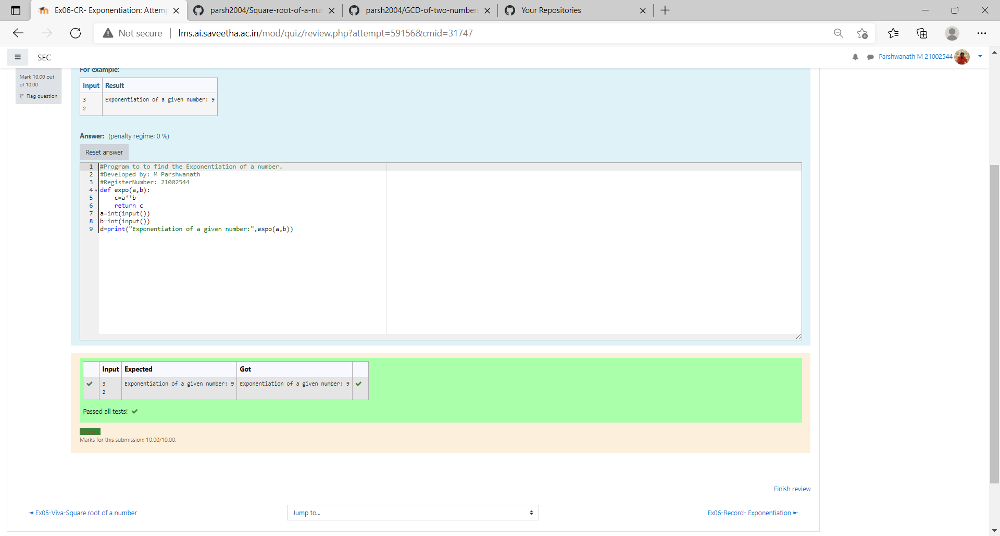

# Find the exponentiation of a number

## AIM:
To write a program to find the exponentiation of a number.

## Equipments Required:
1. Hardware – PCs
2. Anaconda – Python 3.7 Installation / Moodle-Code Runner

## Algorithm
1. Get the input from the user.
2. Use exponentiation operator to find the exponentiation of a number.

## Program:
```
#Program to to find the Exponentiation of a number.
#Developed by: M Parshwanath
#RegisterNumber: 21002544
def expo(a,b):
    c=a**b
    return c 
a=int(input())
b=int(input())
d=print("Exponentiation of a given number:",expo(a,b))
```

## Output:




## Result:
Thus the program to find the exponentiation of a given number is written and verified using python programming.
